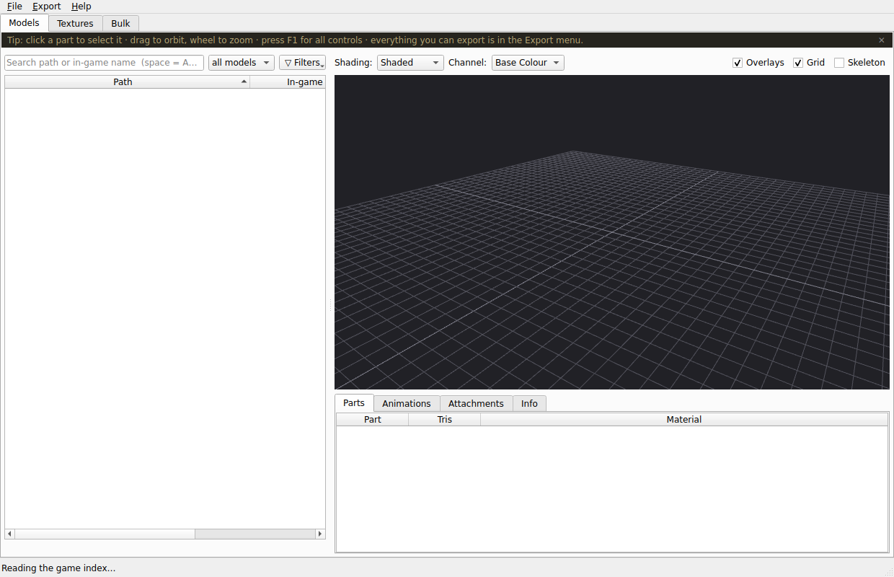
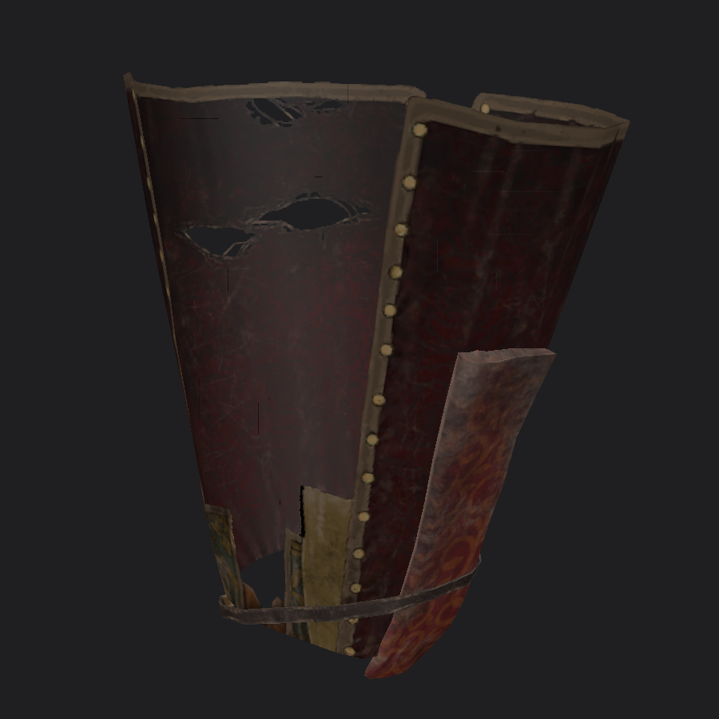

# POE2AssetBrowser

A native **C++17 / Qt6 / OpenGL** asset browser for **Path of Exile 2**. It opens the installed
game's `Bundles2` storage in place — no "extract everything first" step — rebuilds the file paths from
the game's own index, resolves the real in‑game names, and decodes textures and models in‑tool. It
draws models with full metallic‑roughness PBR, plays their animations, assembles characters, and
exports rigged, animated `.glb` / `.gltf`, PNG images, and looping GIFs.

> ## ⚠️ This is an extremely early version (v0.9.0, alpha)
>
> Treat it as a **preview**, not a finished tool. It does a lot and the parts that work are built on
> measured data, but it is early: expect rough edges, missing coverage (see *Honest limitations*
> below), and changes that may not be backward‑compatible between versions. Back up anything you
> care about, and please report what breaks. The high version number is historical — read it as
> "early preview", not "almost 1.0".

It is built on the **AssetBrowser family design** (the D4AssetBrowser template): the same list +
viewport + search + export machinery, with a Path‑of‑Exile‑2 storage and format layer underneath.

   
  <em>A model drawn in the viewport with full metallic‑roughness PBR — leather, worn metal and stitching from the game's own material graph.</em>

## What it does

- **Opens `Bundles2` directly.** Oodle‑decompresses bundles (via the vendored open‑source `ooz`),
  reads `_.index.bin`, and rebuilds all ~1.4 million asset paths (MurmurHash64A) — cross‑checked
  file‑for‑file against a reference parser.
- **Real in‑game names.** Reads the game's `.datc64` data tables to label items, icons, monsters and
  NPCs, so you can search by the name you know ("Einhar", a base item type) instead of a hash. When a
  record's path is encrypted it says *unnamed* rather than inventing a label.
- **Models tab** — every `.smd`/`.fmt` in a shared 3D viewport: flat / shaded / **full PBR** /
  wireframe, a per‑channel viewer (normal, roughness, metallic, AO, emissive), orbit‑pan‑zoom, and
  **part selection as a set** with a right‑click menu (frame, isolate, export parts, copy name). Four
  side panels — Parts, Animations, Attachments, Info. On a mesh that loads on the player base rig,
  an Animations **Move** selector offers the same player animation library as the Customize tab. A **grid/thumbnail view** (rendered icons, flat
  or optional base‑colour‑textured, with a hover preview you can scroll to resize) alongside the list.
- **Customize tab** — a dressing room: pick a class, assemble an outfit from real armour sets and
  per‑slot pieces, toggle hair / head / equipped‑item FX, randomise, save and load outfit presets, and
  export the whole figure or each item separately.
- **Animation** — plays a skinned model's clips in the viewport (scrub, play/pause). In Customize, a
  **player animation library** is wired in: the base rig only carries a static idle, so the real moves
  (sprint, weapon attacks, skills, dodge, death…) are read from the game's ~112 per‑move animation
  files and retargeted onto the assembled character by bone name (also available on the Models tab for
  player‑rig meshes). It fails closed on a piece skinned to
  a rig it doesn't match rather than animating against the wrong skeleton.
- **Attachments** — assembles a body with its coat / hat / weapons on the right bones and follows the
  animation, toggleable per piece.
- **Textures tab** — decodes every `.dds` (BC1/BC7/…) in‑tool, with channel isolation (RGB/R/G/B/A),
  an alpha‑over‑checker view, a pixel inspector, a hover preview and PNG / raw‑DDS export.
- **One Export menu** for everything, each with multi‑select (one file per model):
  - **Models** → `.glb` or `.gltf + .bin` — geometry, skeleton, inverse‑bind matrices and animation
    clips, with a full metallic‑roughness material set embedded; optionally the assembled character.
  - **Selected parts** → just the parts picked in the viewport.
  - **Preview image** → PNG at 25–400 % (re‑rendered larger, not upscaled), transparent background,
    crop‑to‑model.
  - **Turntable GIF** (orbits the model centre) and **Animation‑loop GIF** — with a size‑budget optimiser.
  - **Original‑format / raw** extraction for non‑destructive export of the authored bytes.
- **Bulk tab** — extract thousands of assets in one parallel run, with folder‑layout choices, an
  only‑new manifest, live progress and a working pause / cancel; raw‑originals mode included.
- **Filters** — a funnel of tags drawn from the game's own folder tree (Items, Monsters, Characters,
  NPCs…), a shader‑family facet, and a search language (`space` = AND, `-` exclude, `a|b` OR, a number
  = find by id).
- **It explains itself** — Health check (present / unnamed / absent), Explain material (which PBR
  values are authored vs. substituted), an in‑app **F1** cheat‑sheet, and a full Settings dialog with
  rebindable hotkeys.

Everything the tool writes lives in a `data\` folder beside the exe (settings as INI, the index cache,
thumbnails) — move the folder and it keeps working; delete it and nothing is left behind.

## Documentation

The full manual lives in the [wiki](wiki/) (also published as the GitHub Wiki tab). Each page answers
one question:

| Page | Answers |
|---|---|
| [Install](wiki/Install.md) | Download, first run, the folder it needs, the SmartScreen warning |
| [The tabs](wiki/The-tabs.md) | What each tab is for and when to use which |
| [Keyboard & mouse](wiki/Keyboard-and-mouse.md) | Every camera control, shortcut and search operator |
| [Exporting](wiki/Exporting.md) | Models, textures, images and GIFs it writes, the options, the axis convention |
| [Settings](wiki/Settings.md) | Every option in the Settings dialog, tab by tab |
| [Asset formats](wiki/Asset-formats.md) | How PoE2's data is really put together — measured, with the method |
| [Diagnostics](wiki/Diagnostics.md) | The self‑explaining reports: Health check, Explain material, Find by id |
| [After a game patch](wiki/After-a-game-patch.md) | What re‑reads automatically and what to check |
| [Building from source](wiki/Building-from-source.md) | Prerequisites, the build, the checks, cutting a release |
| [Troubleshooting](wiki/Troubleshooting.md) | Routed by symptom, opening with a triage table |
| [FAQ](wiki/FAQ.md) | The quick questions, answered |
| [Glossary](wiki/Glossary.md) | One line per term the rest of the docs assume |

The authoritative, measured format reference is **[docs/FORMATS.md](docs/FORMATS.md)** — every number in
it came from the real install, with the method stated, and it says out loud where it is unsure.

## Getting started

1. Build it (see [Building from source](wiki/Building-from-source.md)) or download a release.
2. Run `POE2AssetBrowser.exe`. From **File ▸ Set Path of Exile 2 folder…**, point it at your install
   (the folder that contains `Bundles2`). It reads the index once (~10–15 s) and caches it.
3. Browse the Models and Textures tabs; double‑click a row to load it. Everything you can export is in
   the **Export** menu (**Ctrl+E** exports the selected model).

## Honest limitations

The tool is broad, but it is **early** and it says what it does not do rather than pretending:

- **This is an alpha.** Expect rough edges and bugs; settings and cache formats may change between
  versions. Nothing here is load‑bearing yet.
- **Legacy `.fmt` versions 4–8** (older static meshes) and **`.tmd`** terrain geometry are not decoded
  yet. The tool names the version it could not read instead of drawing garbage.
- **Some full‑character NPCs load in a head‑down bind pose** — that is how their rig is authored; orbit
  the camera to view them. Gear pieces and items are unaffected.
- **Animated attachments are a work in progress.** On the assembled, animated figure, worn pieces are
  merged and weighted rigidly to their parent bone — they move *with* the body, but cloth/secondary
  motion is not simulated.
- **The player animation library is new.** Clips are retargeted onto the base rig by bone name and
  verified to produce motion; if a move doesn't match a given rig the tool says so rather than
  mangling the pose.

Nothing proprietary ships in this repo — no game assets, no decryption keys. The Oodle decompressor
(`third_party/ooz`, powzix, public domain) and the BC texture decoder (`third_party/bcdec`, iOrange,
MIT) are the only vendored third‑party code, both open source. The preview images above are screenshots
of the tool.

## Credits

Format research stands on the community's work: the ggpk.discussion wiki (bundle scheme), aianlinb's
LibGGPK3 (the hash variants), and Shadowth117's PSO2‑Aqua‑Library (the first PoE2 SMD/AST readers).
Where their notes and the real install disagreed, the install won and this repo says which answered.
